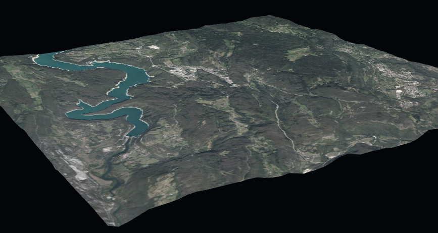

# Giro3D exemple

L'objectif de cet exemple est de manipuler une carte en 3D (MNS ou MNT + Orthophotos) avec [Giro3D](https://giro3d.org/).
Il s'appuie sur les exemples de la librairie et la Géoplateforme dont deux couches [WMS](https://data.geopf.fr/wms-r/wms?SERVICE=WMS&VERSION=1.3.0&REQUEST=GetCapabilities) sont mobilisées :
* `ELEVATION.ELEVATIONGRIDCOVERAGE.HIGHRES.MNS` pour avoir un Modèle Numérique de Surface
* `HR.ORTHOIMAGERY.ORTHOPHOTOS` qui vient se plaquer sur le MNS

La zone retenue est un carré de 20km de côté centré sur Saint Claude (39200).

Une démonstraction est disponible [ici](https://cvagner.github.io/giro3d-exemple/).



## Développement

Installer les dépendances :
```sh
# Dernières versions
npm install

# Ou telles quelles
npm ci
```

Démarrer en local :
```sh
npm run start
```

Ouvrir : http://localhost:5173/.

## Construction

Construire l'application et copier le jeu de données :
```sh
npm run build
```

Il s'agit ensuite de servir en HTTP le contenu du répertoire `dist`.